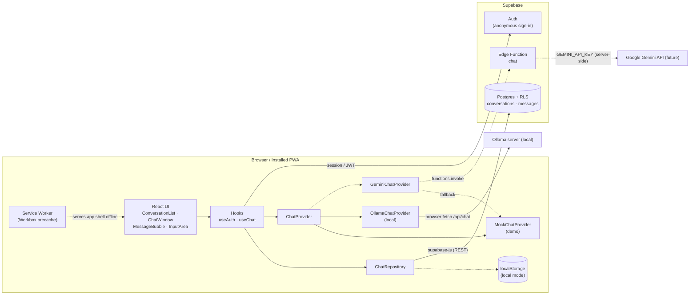
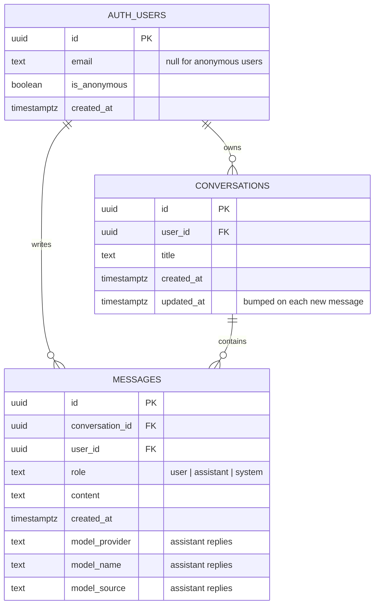
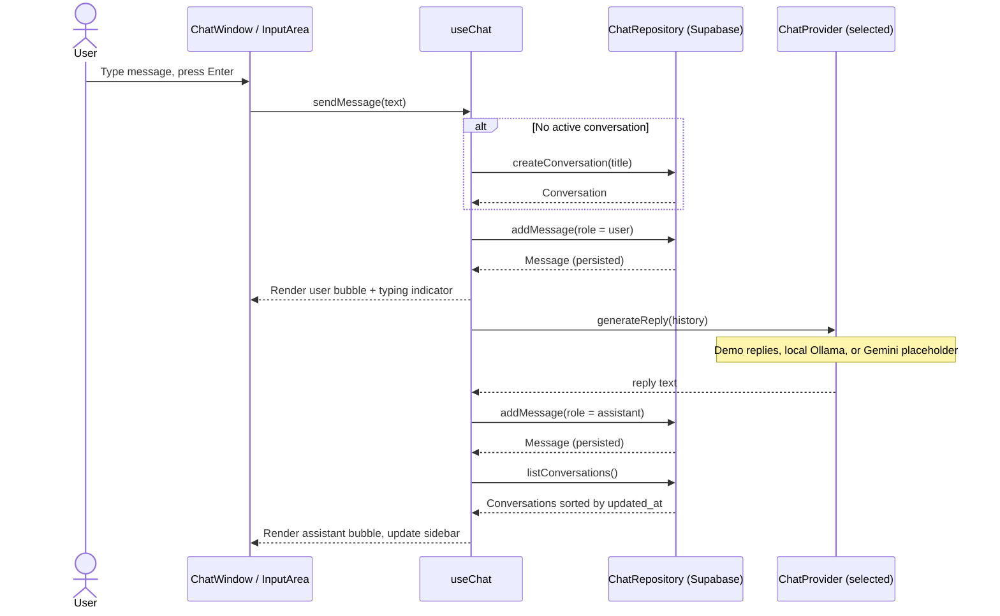

# ai-chat

A minimal, installable **ChatGPT-style chat app** built as a Progressive Web App with React, Vite, Tailwind CSS and Supabase.

The app ships a full chat experience (conversation list, chat bubbles, persistence, offline-capable app shell) and supports both **hardcoded demo replies** and local inference through **Ollama**. Providers are selected behind a shared `ChatProvider` registry, so additional providers can be added without changing chat orchestration or UI.

- ⚡ React 19 + TypeScript + Vite 8
- 🎨 Tailwind CSS v4, light/dark mode, mobile-friendly sidebar
- 📝 Accessible Markdown replies, adjustable text size, and system/light/dark appearance settings
- 📲 PWA: installable, precached app shell, update prompt
- 🗄️ Supabase Postgres with Row Level Security, anonymous auth
- 🤖 Ollama local LLM + extensible provider catalog; Gemini Edge Function placeholder
- 💾 Works with no backend: falls back to `localStorage` when Supabase isn't configured

See [`CLAUDE.md`](./CLAUDE.md) for the full technical spec and [`docs/BACKLOG.md`](./docs/BACKLOG.md) for user stories and the roadmap.

---

## Quick start

Requirements: **Node.js 22.12+** and npm.

```bash
npm install
npm run dev
```

Open http://localhost:5173. With no env vars set, the app runs in **local mode**: chats are saved in your browser only.

Use the settings gear in the chat header to choose system, light, or dark appearance, adjust application text size, and select a model. Each message shows its timestamp; assistant replies also show the selected model details and can be copied as Markdown. Assistant messages render safe Markdown and GitHub-flavored tables; raw HTML from model output is not rendered as markup.

## Connecting Supabase

1. **Create a project** at [supabase.com](https://supabase.com).
2. **Enable anonymous sign-ins**: Dashboard → Authentication → Sign In / Providers → *Allow anonymous sign-ins*.
3. **Apply the schema**, either with the CLI:
   ```bash
   npx supabase login
   npx supabase link --project-ref <your-project-ref>
   npx supabase db push
   ```
   or by running both SQL migrations in order in the dashboard's SQL Editor: `20261007000000_init.sql`, then `20261008000000_add_message_model_details.sql`.
4. **Configure env vars**:
   ```bash
   cp .env.example .env.local
   ```
   Then fill in `VITE_SUPABASE_URL` and `VITE_SUPABASE_ANON_KEY` (Project Settings → API).
5. Restart `npm run dev`. The sidebar footer should now read *Synced with Supabase*.

### Running Supabase locally (optional)

```bash
npx supabase start          # requires Docker; applies migrations automatically
npx supabase status         # prints the local API URL and anon key for .env.local
```

## Environment variables

| Variable | Required | Description |
| --- | --- | --- |
| `VITE_SUPABASE_URL` | no* | Supabase project URL |
| `VITE_SUPABASE_ANON_KEY` | no* | Supabase anon/publishable key (safe to expose; data is protected by RLS) |
| `VITE_AI_PROVIDER` | no | `mock` (default), `ollama`, or `gemini` |
| `VITE_MOCK_REPLY_DELAY_MS` | no | Simulated reply latency, default `700` |
| `VITE_OLLAMA_BASE_URL` | no | Ollama server URL, default `http://localhost:11434` |
| `VITE_OLLAMA_MODEL` | no | Installed Ollama model, default `llama3.2` |
| `GEMINI_API_KEY` | later | **Server-side only.** Set as a Supabase secret, never with a `VITE_` prefix |
| `GEMINI_MODEL` | later | Gemini model id used by the Edge Function |

\* Without them the app uses local mode.

## Connecting local Ollama

1. Install and start [Ollama](https://ollama.com/), then download a model:
   ```bash
   ollama pull llama3.2
   ```
2. Allow the origin serving this app in Ollama's CORS configuration. For local Vite development, set `OLLAMA_ORIGINS=http://localhost:5173,http://127.0.0.1:5173` in Ollama's environment before starting/restarting `ollama serve`. For another app origin, allow that exact origin instead. Do not expose Ollama with a wildcard origin.
3. In `.env.local`, select Ollama and (optionally) a different server or installed model:
   ```dotenv
   VITE_AI_PROVIDER=ollama
   VITE_OLLAMA_BASE_URL=http://localhost:11434
   VITE_OLLAMA_MODEL=llama3.2
   ```
4. Restart `npm run dev`. Open the gear button in the chat header to see the active source and choose from installed Ollama models. Prompts are sent directly from the browser to this configured Ollama URL; Ollama runs on your hardware and has no per-token provider charge.

The browser calls Ollama's non-streaming `/api/chat` endpoint and cancels an in-flight request when the user presses Stop. Because this SPA connects directly, browser CORS must allow the exact app origin. Ollama must be reachable from the device running the browser; this setup does not expose your local Ollama server to other users of a deployed site. No Ollama API key is put in the browser.

## Provider catalog and pricing

Provider implementations share the `ChatProvider` contract and are selected through the registry in `src/services/ai/`. The catalog records pricing semantics: Ollama is local/no per-token provider charge, demo replies are free, and Gemini pricing is marked unknown until a model and current rates are explicitly configured. It does not claim to calculate costs. Future providers such as Claude can add an implementation and catalog entry while leaving the UI and chat flow unchanged; hosted-provider credentials should remain server-side.

## Scripts

| Script | Description |
| --- | --- |
| `npm run dev` | Start the dev server (service worker enabled) |
| `npm run build` | Type-check and build to `dist/` |
| `npm run preview` | Serve the production build. Use this to test install and offline mode |
| `npm run lint` | Run ESLint |
| `npm run typecheck` | Run the TypeScript compiler |
| `npm test` | Run the unit tests (Vitest) |
| `npm run generate-pwa-assets` | Regenerate app icons from `public/favicon.svg` |

## Testing the PWA

```bash
npm run build && npm run preview
```

Open http://localhost:4173 in Chrome, then use the install icon in the address bar. In DevTools → Application you can inspect the manifest and service worker, and toggle *Offline* to confirm the app shell still loads.

## Enabling Gemini (future)

1. Implement the Gemini call in `supabase/functions/chat/index.ts` (instructions are in the file).
2. `npx supabase secrets set GEMINI_API_KEY=... GEMINI_MODEL=...`
3. `npx supabase functions deploy chat`
4. Set `VITE_AI_PROVIDER=gemini` and rebuild.

If the function fails, the client falls back to demo replies, so the chat keeps working.

---

## Diagrams

### System architecture



Dashed lines are optional or future paths.

### Database (ER diagram)



### Basic chat flow (sequence)



---

## Project structure

```
src/
  components/   Presentational UI (ChatWindow, MessageBubble, InputArea, ConversationList, …)
  hooks/        useAuth, useChat
  lib/          env parsing, Supabase client
  services/
    ai/         ChatProvider interface, provider catalog, mock + Ollama + Gemini providers
    chat/       ChatRepository interface, Supabase + localStorage repositories
  types/        Domain types
supabase/
  migrations/   SQL schema + RLS
  functions/    Edge Functions (chat → Gemini, future)
docs/BACKLOG.md User stories & roadmap
```

## License

[MIT](./LICENSE)
