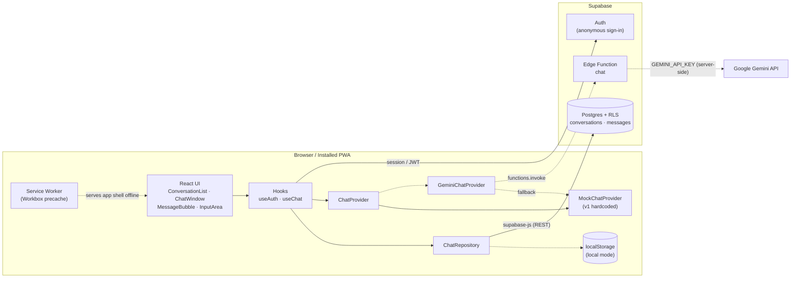
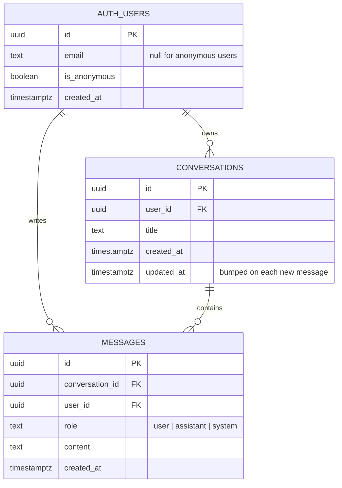
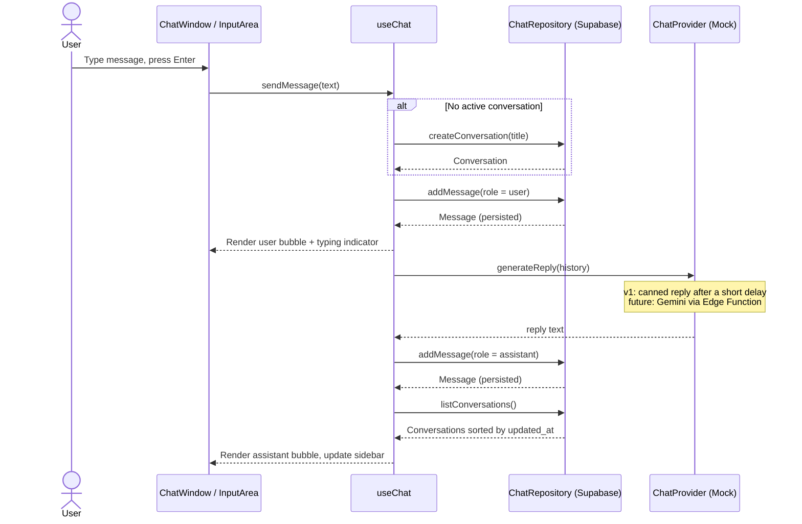

# ai-chat

A minimal, installable **ChatGPT-style chat app** built as a Progressive Web App with React, Vite, Tailwind CSS and Supabase.

v1 ships the full chat experience (conversation list, chat bubbles, persistence, offline-capable app shell) with **hardcoded assistant replies**. The AI layer sits behind a `ChatProvider` interface, so you can plug in Google Gemini later without changing the UI.

- ⚡ React 19 + TypeScript + Vite 8
- 🎨 Tailwind CSS v4, light/dark mode, mobile-friendly sidebar
- 📲 PWA: installable, precached app shell, update prompt
- 🗄️ Supabase Postgres with Row Level Security, anonymous auth
- 🤖 Gemini-ready: provider abstraction + Edge Function stub (API key stays server-side)
- 💾 Works with no backend: falls back to `localStorage` when Supabase isn't configured

See [`CLAUDE.md`](./CLAUDE.md) for the full technical spec and [`docs/BACKLOG.md`](./docs/BACKLOG.md) for user stories and the roadmap.

---

## Quick start

Requirements: **Node.js 22.12+** and npm.

```bash
npm install
npm run dev
```

Open http://localhost:5173. With no env vars set, the app runs in **local mode**: chats are saved in your browser only.

## Connecting Supabase

1. **Create a project** at [supabase.com](https://supabase.com).
2. **Enable anonymous sign-ins**: Dashboard → Authentication → Sign In / Providers → *Allow anonymous sign-ins*.
3. **Apply the schema**, either with the CLI:
   ```bash
   npx supabase login
   npx supabase link --project-ref <your-project-ref>
   npx supabase db push
   ```
   or by pasting `supabase/migrations/20261007000000_init.sql` into the dashboard's SQL Editor and running it.
4. **Configure env vars**:
   ```bash
   cp .env.example .env.local
   ```
   Then fill in `VITE_SUPABASE_URL` and `VITE_SUPABASE_ANON_KEY` (Project Settings → API).
5. Restart `npm run dev`. The sidebar footer should now read *Synced with Supabase*.

### Running Supabase locally (optional)

```bash
npx supabase start          # requires Docker; applies migrations automatically
npx supabase status         # prints the local API URL and anon key for .env.local
```

## Environment variables

| Variable | Required | Description |
| --- | --- | --- |
| `VITE_SUPABASE_URL` | no* | Supabase project URL |
| `VITE_SUPABASE_ANON_KEY` | no* | Supabase anon/publishable key (safe to expose; data is protected by RLS) |
| `VITE_AI_PROVIDER` | no | `mock` (default) or `gemini` |
| `VITE_MOCK_REPLY_DELAY_MS` | no | Simulated reply latency, default `700` |
| `GEMINI_API_KEY` | later | **Server-side only.** Set as a Supabase secret, never with a `VITE_` prefix |
| `GEMINI_MODEL` | later | Gemini model id used by the Edge Function |

\* Without them the app uses local mode.

## Scripts

| Script | Description |
| --- | --- |
| `npm run dev` | Start the dev server (service worker enabled) |
| `npm run build` | Type-check and build to `dist/` |
| `npm run preview` | Serve the production build. Use this to test install and offline mode |
| `npm run lint` | Run ESLint |
| `npm run typecheck` | Run the TypeScript compiler |
| `npm test` | Run the unit tests (Vitest) |
| `npm run generate-pwa-assets` | Regenerate app icons from `public/favicon.svg` |

## Testing the PWA

```bash
npm run build && npm run preview
```

Open http://localhost:4173 in Chrome, then use the install icon in the address bar. In DevTools → Application you can inspect the manifest and service worker, and toggle *Offline* to confirm the app shell still loads.

## Enabling Gemini (future)

1. Implement the Gemini call in `supabase/functions/chat/index.ts` (instructions are in the file).
2. `npx supabase secrets set GEMINI_API_KEY=... GEMINI_MODEL=...`
3. `npx supabase functions deploy chat`
4. Set `VITE_AI_PROVIDER=gemini` and rebuild.

If the function fails, the client falls back to the mock provider, so the chat keeps working.

---

## Diagrams

### System architecture



Dashed lines are optional or future paths.

### Database (ER diagram)



### Basic chat flow (sequence)



---

## Project structure

```
src/
  components/   Presentational UI (ChatWindow, MessageBubble, InputArea, ConversationList, …)
  hooks/        useAuth, useChat
  lib/          env parsing, Supabase client
  services/
    ai/         ChatProvider interface, mock + Gemini providers
    chat/       ChatRepository interface, Supabase + localStorage repositories
  types/        Domain types
supabase/
  migrations/   SQL schema + RLS
  functions/    Edge Functions (chat → Gemini, future)
docs/BACKLOG.md User stories & roadmap
```

## License

[MIT](./LICENSE)
